<!-- README.md is generated from README.Rmd. Please edit that file -->

# lgbthue

<!-- badges: start -->

[](https://lifecycle.r-lib.org/articles/stages.html#experimental)
[](https://CRAN.R-project.org/package=lgbthue)
[](https://github.com/turtletopia/lgbthue/actions/workflows/R-CMD-check.yaml)
[](https://app.codecov.io/gh/turtletopia/lgbthue)
<!-- badges: end -->

The goal of lgbthue is to provide palette data for pride flags for use
by [gglgbtq](https://github.com/turtletopia/gglgbtq) and future
projects.

## Installation

You can install the development version of lgbthue from
[GitHub](https://github.com/) with:

``` r
# install.packages("pak")
pak::pak("turtletopia/lgbthue")
```

## User guide

To list all available palettes, call `show_pride()`. The output would be
very long, however, so I’m not including the result. Instead, know it is
possible to filter by tags and palette sizes:

``` r
show_pride(tags = "rainbow", sizes = c(6, 8))
```

<div class="asciicast"
style="color: #B9C0CB;font-family: 'Fira Code',Monaco,Consolas,Menlo,'Bitstream Vera Sans Mono','Powerline Symbols',monospace;line-height: 1.300000">

<pre>
#> rainbow [6]                                                                     
#>  <span style="color:#e40303;">█</span> #E40303                                                                      
#>  <span style="color:#ff8c00;">█</span> #FF8C00                                                                      
#>  <span style="color:#ffed00;">█</span> #FFED00                                                                      
#>  <span style="color:#008026;">█</span> #008026                                                                      
#>  <span style="color:#24408e;">█</span> #24408E                                                                      
#>  <span style="color:#732982;">█</span> #732982                                                                      
#>  [<span style="color: #71BEF2;">rainbow</span>]                                                                      
#>                                                                                 
#> philadelphia [8]                                                                
#>  <span style="color:#000000;">█</span> #000000                                                                      
#>  <span style="color:#784f17;">█</span> #784F17                                                                      
#>  <span style="color:#d12229;">█</span> #D12229                                                                      
#>  <span style="color:#f68a1e;">█</span> #F68A1E                                                                      
#>  <span style="color:#fde01a;">█</span> #FDE01A                                                                      
#>  <span style="color:#007940;">█</span> #007940                                                                      
#>  <span style="color:#24408e;">█</span> #24408E                                                                      
#>  <span style="color:#732982;">█</span> #732982                                                                      
#>  [<span style="color: #71BEF2;">rainbow</span>]                                                                      
#>                                                                                 
</pre>

</div>

Accessing one of these is best done by `palette_lgbtq()`:

``` r
palette_lgbtq("lesbian")
```

<div class="asciicast"
style="color: #B9C0CB;font-family: 'Fira Code',Monaco,Consolas,Menlo,'Bitstream Vera Sans Mono','Powerline Symbols',monospace;line-height: 1.300000">

<pre>
#> lesbian [5]                                                                     
#>  <span style="color:#d62900;">█</span> #D62900                                                                      
#>  <span style="color:#ff9b55;">█</span> #FF9B55                                                                      
#>  <span style="color:#ffffff;">█</span> #FFFFFF                                                                      
#>  <span style="color:#d461a6;">█</span> #D461A6                                                                      
#>  <span style="color:#a50062;">█</span> #A50062                                                                      
#>  [<span style="color: #71BEF2;">sexuality</span>]                                                                    
</pre>

</div>

Such palettes can be used anywhere a palette is needed, plots in
particular. For example:

``` r
group <- rep(1:6, each = 10)
x <- group + .5 * rnorm(60)
y <- runif(60, 1, 1.5) * sqrt(group)
plot(x, y, pch = 19, col = palette_lgbtq("rainbow")[group], cex = 2)
```

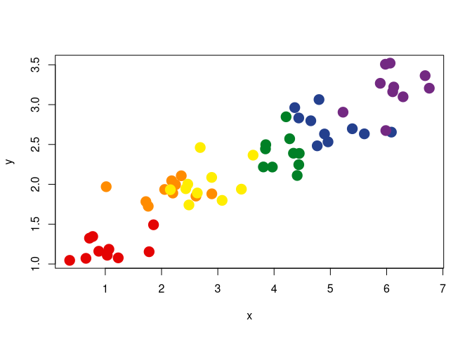

If you wish to use these palettes with ggplot2,
[gglgbtq](https://github.com/turtletopia/gglgbtq) adapts these palettes
to that particular use case.

Moreover, as a palette draws from the colors of a flag, a `seq()` method
is provided that transforms a palette into a sequence so that e.g. a
vertical bar with correct flag colors can be shown:

``` r
seq(palette_lgbtq("trans"))
```

<div class="asciicast"
style="color: #B9C0CB;font-family: 'Fira Code',Monaco,Consolas,Menlo,'Bitstream Vera Sans Mono','Powerline Symbols',monospace;line-height: 1.300000">

<pre>
#> transgender [seq 5]                                                             
#>  <span style="color:#55cdfc;">█</span> #55CDFC                                                                      
#>  <span style="color:#f7a8b8;">█</span> #F7A8B8                                                                      
#>  <span style="color:#ffffff;">█</span> #FFFFFF                                                                      
#>  <span style="color:#f7a8b8;">█</span> #F7A8B8                                                                      
#>  <span style="color:#55cdfc;">█</span> #55CDFC                                                                      
</pre>

</div>

## Gallery

Only a few most common palettes are included below. For the complete
list, see [palette gallery
vignette](https://turtletopia.github.io/lgbthue/articles/gallery.html).

``` r
plot(palette_lgbtq("rainbow"))
```

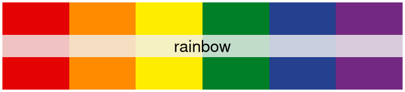

``` r
plot(palette_lgbtq("philadelphia"))
```

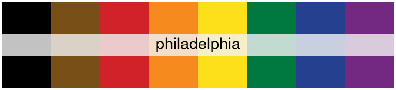

``` r
plot(palette_lgbtq("progress"))
```

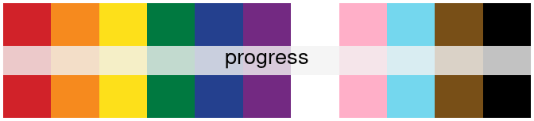

``` r
plot(palette_lgbtq("lesbian"))
```

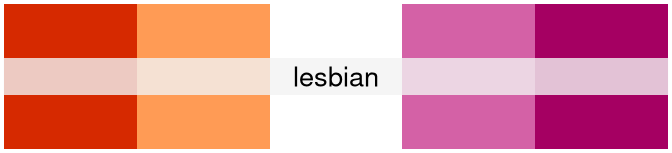

``` r
# In its original meaning of "gay men"
plot(palette_lgbtq("gay"))
```

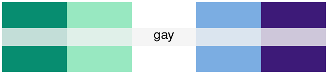

``` r
plot(palette_lgbtq("bisexual"))
```

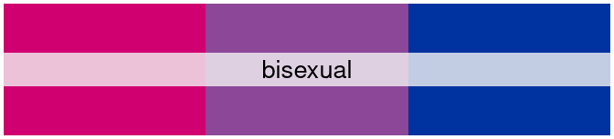

``` r
# Background added to avoid the "disappearance" of the white stripe
plot(palette_lgbtq("transgender"), background = "gray92")
```

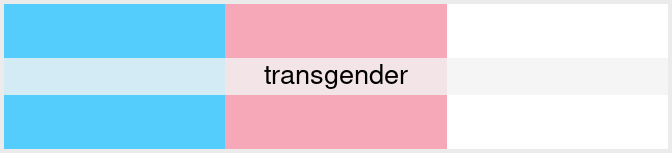

``` r
plot(palette_lgbtq("asexual"))
```

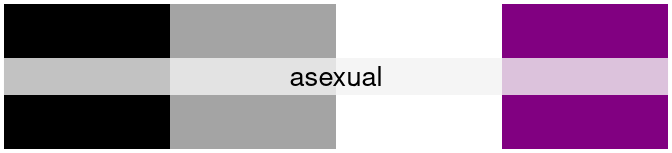

``` r
plot(palette_lgbtq("nonbinary"))
```

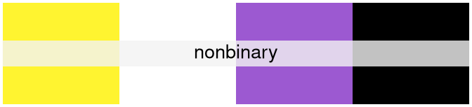

``` r
plot(palette_lgbtq("intersex"))
```

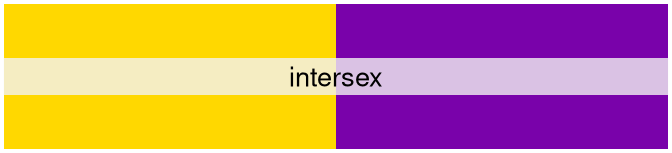
