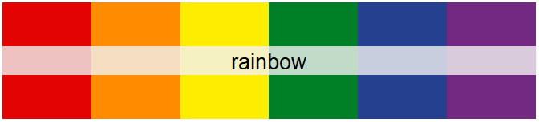
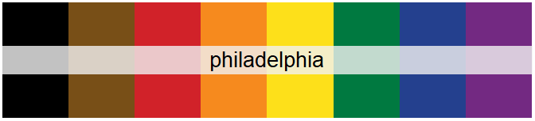
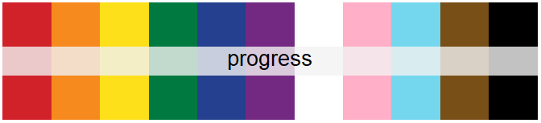
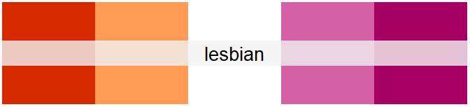
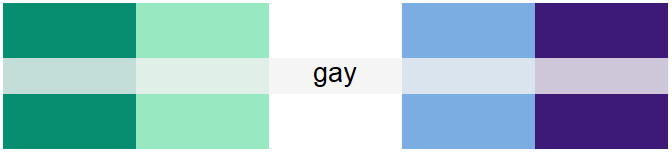
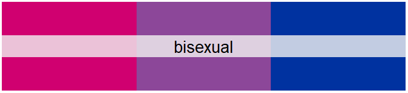
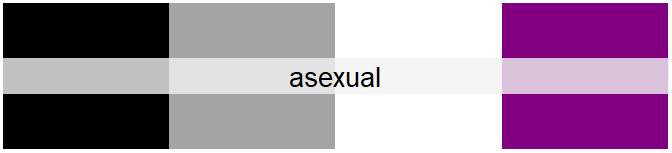
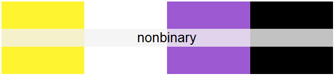
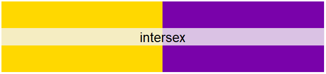

# lgbthue

The goal of lgbthue is to provide palette data for pride flags for use
by [gglgbtq](https://github.com/turtletopia/gglgbtq) and future
projects.

## Installation

You can install the development version of lgbthue from
[GitHub](https://github.com/) with:

``` r

# install.packages("pak")
pak::pak("ErdaradunGaztea/lgbthue")
```

## User guide

To list all available palettes, call
[`show_pride()`](https://erdaradungaztea.github.io/lgbthue/reference/show_pride.md).
The output would be very long, however, so I’m not including the result.
Instead, know it is possible to filter by tags and palette sizes:

``` r

library(lgbthue)
show_pride(tags = "rainbow", sizes = c(6, 8))
#> rainbow [6]
#>  █ #E40303
#>  █ #FF8C00
#>  █ #FFED00
#>  █ #008026
#>  █ #24408E
#>  █ #732982
#>  [rainbow]
#> 
#> philadelphia [8]
#>  █ #000000
#>  █ #784F17
#>  █ #D12229
#>  █ #F68A1E
#>  █ #FDE01A
#>  █ #007940
#>  █ #24408E
#>  █ #732982
#>  [rainbow]
```

Accessing one of these is best done by
[`palette_lgbtq()`](https://erdaradungaztea.github.io/lgbthue/reference/palette_lgbtq.md):

``` r

palette_lgbtq("lesbian")
#> lesbian [5]
#>  █ #D62900
#>  █ #FF9B55
#>  █ #FFFFFF
#>  █ #D461A6
#>  █ #A50062
#>  [sexuality]
```

Such palettes can be used anywhere a palette is needed, plots in
particular. For example:

``` r

group <- rep(1:6, each = 10)
x <- group + .5 * rnorm(60)
y <- runif(60, 1, 1.5) * sqrt(group)
plot(x, y, pch = 19, col = palette_lgbtq("rainbow")[group], cex = 2)
```


If you wish to use these palettes with ggplot2,
[gglgbtq](https://github.com/turtletopia/gglgbtq) adapts these palettes
to that particular use case.

## Gallery

Only a few most common palettes are included below. For the complete
list, see [palette gallery
vignette](https://ErdaradunGaztea.github.io/lgbthue/articles/gallery.html).

``` r

plot(palette_lgbtq("rainbow"))
```



``` r

plot(palette_lgbtq("philadelphia"))
```



``` r

plot(palette_lgbtq("progress"))
```



``` r

plot(palette_lgbtq("lesbian"))
```



``` r

# In its original meaning of "gay men"
plot(palette_lgbtq("gay"))
```



``` r

plot(palette_lgbtq("bisexual"))
```



``` r

# Background added to avoid the "disappearance" of the white stripe
plot(palette_lgbtq("transgender"), background = "gray92")
```


``` r

plot(palette_lgbtq("asexual"))
```



``` r

plot(palette_lgbtq("nonbinary"))
```



``` r

plot(palette_lgbtq("intersex"))
```


